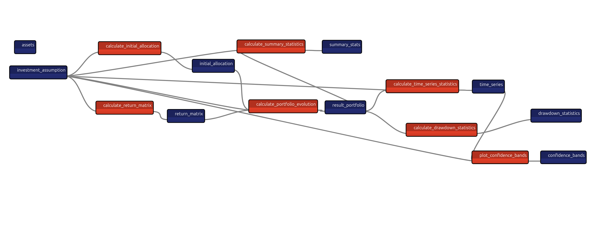

# Taipy Financial Planning


- [Taipy Financial Planning](#taipy-financial-planning)
  - [What is This App?](#what-is-this-app)
    - [Key Features](#key-features)
  - [Quick Start](#quick-start)
    - [Prerequisites](#prerequisites)
    - [Basic Installation](#basic-installation)
    - [Docker Image](#docker-image)
  - [How to Use](#how-to-use)
    - [1. Asset Management](#1-asset-management)
    - [2. Create Investment Scenarios](#2-create-investment-scenarios)
    - [3. Compare Scenarios](#3-compare-scenarios)
  - [Architecture](#architecture)
    - [Project Structure](#project-structure)
    - [Data Flow](#data-flow)
    - [Key Components](#key-components)
  - [The Math Behind It](#the-math-behind-it)
    - [Monte Carlo Simulation](#monte-carlo-simulation)
    - [Risk Metrics](#risk-metrics)
  - [License](#license)
  - [Learn More](#learn-more)
  - [Support](#support)

Financial planning application built with [Taipy](https://www.taipy.io/) that uses Monte Carlo simulations to forecast investment portfolio returns and analyze risk.

## What is This App?

This application helps you visualize the uncertainty in investment returns by running thousands of simulations based on probability distributions. Instead of getting a single prediction, you see a range of possible outcomes, helping you make more informed investment decisions.

### Key Features

- 🎲 **Monte Carlo Simulations**: Run 500-2,000 trials to explore possible portfolio outcomes
- 📊 **Multiple Asset Types**: Support for normal and lognormal distributions
- 💼 **Portfolio Management**: Create custom asset allocations with different investment products
- 📈 **Rich Analytics**: Comprehensive statistics including CAGR, drawdowns, percentiles, and risk metrics
- 🔄 **Scenario Comparison**: Compare different investment strategies side-by-side
- 💾 **Persistent Scenarios**: Save and version your simulations for future reference
- 📉 **Interactive Visualizations**: Confidence bands, time series, and comparison charts

## Quick Start

### Prerequisites

- Python 3.9 or higher
- pip or uv package manager

### Basic Installation

1. Clone the repository:

```bash
git clone https://github.com/enarroied/taipy_financial_planning.git
cd taipy_financial_planning
```

2. Install dependencies:

Using pip:

```bash
pip install taipy numpy pandas plotly
```

Using uv (recommended):

```bash
uv sync
```

3. Run the application:

```bash
python src/main.py
```

or:

```bash
uv run --directory  src main.py
```

The application will start on `http://localhost:5000`

### Docker Image

The app provides a dockerfile. You can create an image with the following command (here, `finder-image` is the image name, you can give it any other name):

```bash
docker build -t financial-planning .
```

Then you can ruin the image:

```bash
docker run -p 5000:5000 financial-planning
```

## How to Use

### 1. Asset Management

Navigate to the **Asset Creation** page to define your investment products:

- **Edit existing assets**: Select an asset, change its distribution type (normal/lognormal), mean return, and standard deviation
- **Create new assets**: Give it a name and create it with default parameters
- **Delete assets**: Remove assets you no longer need

Example assets:

- **US Stocks**: Lognormal distribution, 8% mean return, 15% std dev
- **Bonds**: Normal distribution, 3% mean return, 5% std dev
- **International Stocks**: Lognormal distribution, 7% mean return, 18% std dev

### 2. Create Investment Scenarios

Go to the **Scenario Creation** page to build your portfolio:

1. Set your investment parameters:
   - Initial capital (e.g., $10,000)
   - Investment horizon in years (e.g., 10 years)
   - Number of Monte Carlo trials (500-2,000)

2. Select up to 6 assets and assign percentages (must sum to 100%)

3. Name your scenario and click "Create Scenario"

4. The simulation runs automatically, generating:
   - 1,000+ possible futures for your portfolio
   - Summary statistics (mean, median, percentiles)
   - Risk metrics (drawdowns, probability of loss)
   - Time series evolution with confidence bands

**Scenario Pipeline:**



### 3. Compare Scenarios

Visit the **Compare Scenarios** page to evaluate different strategies:

- Select two scenarios from your saved simulations
- View side-by-side comparisons of:
  - Return metrics (total return, CAGR, final values)
  - Risk metrics (standard deviation, probability of loss)
  - Distribution metrics (5th and 95th percentiles)
- Interactive gauge charts show which scenario performs better
- Full detailed breakdowns help you understand the tradeoffs

## Architecture

### Project Structure

```text
taipy_financial_planning/
├── src/
│   ├── algorithms/
│   │   ├── calculate_evolution.py      # Core Monte Carlo simulation
│   │   ├── calculate_statistics.py     # Statistical analysis
│   │   ├── plot_confidence_bars.py     # Visualization functions
│   │   ├── plot_kpis.py                # KPI gauge charts
│   │   └── scenario_creation_callbacks.py  # UI callbacks
│   ├── pages/
│   │   ├── asset_creation_page.py      # Asset management UI
│   │   ├── scenario_creation_page.py   # Portfolio creation UI
│   │   ├── scenario_comparison_page.py # Comparison UI
│   │   └── page_helpers.py             # Reusable UI components
│   ├── config.py                       # Taipy pipeline configuration
│   ├── context.py                      # Data models (dataclasses)
│   └── main.py                         # Application entry point
├── data/
│   └── assets.json                     # Persistent asset definitions
└── pyproject.toml                      # Project dependencies
```

### Data Flow

```text
User Input (Portfolio)
    → Investment Assumption
    → Calculate Initial Allocations
    → Generate Return Matrix (Monte Carlo)
    → Calculate Portfolio Evolution
    → Calculate Statistics (Summary, Drawdown, Time Series)
    → Generate Visualizations
    → Display Results & Enable Comparison
```

### Key Components

**Dataclasses (`context.py`)**:
****
- `Asset`: Defines an investment product with distribution parameters
- `InvestmentAssumption`: Complete portfolio configuration
- `SummaryStatistics`: Aggregated simulation results

**Monte Carlo Engine (`calculate_evolution.py`)**:

- `calculate_return_matrix()`: Generates thousands of random return scenarios
- `calculate_portfolio_evolution()`: Simulates portfolio growth over time
- Supports normal and lognormal distributions

**Statistical Analysis (`calculate_statistics.py`)**:

- Summary statistics (mean, median, std, percentiles)
- Drawdown analysis (maximum peak-to-trough declines)
- Time series aggregations by year

**Taipy Pipeline (`config.py`)**:

- Configured data nodes for inputs/outputs
- Task definitions for each computational step
- Scenario management for versioning and persistence

## The Math Behind It

### Monte Carlo Simulation

The application generates a 3D return matrix with shape `(num_trials, horizon_years, num_assets)`. For a 10-year investment with 3 assets and 1,000 trials, this creates 30,000 individual return samples.

**Normal Distribution**:

```python
returns = np.random.normal(
    loc=mean_return,      # Expected annual return
    scale=std_dev,        # Volatility
    size=(trials, years)
)
```

**Lognormal Distribution** (for assets that can't go negative):

```python
returns = np.random.lognormal(
    mean=mu_log,          # Log-space mean
    sigma=sigma_log,      # Log-space std dev
    size=(trials, years)
)
```

### Risk Metrics

- **Probability of Loss**: `P(final_value < initial_capital)`
- **Maximum Drawdown**: `max((peak_value - trough_value) / peak_value)`
- **CAGR**: `(final_value / initial_capital)^(1/years) - 1`
- **Percentiles**: 5th, 25th, 75th, 95th to show distribution of outcomes

## License

This project is licensed under the [MIT License](LICENSE).

## Learn More

- [Taipy Documentation](https://docs.taipy.io/)
- [Monte Carlo Methods in Finance](https://en.wikipedia.org/wiki/Monte_Carlo_methods_in_finance)
- [Modern Portfolio Theory](https://en.wikipedia.org/wiki/Modern_portfolio_theory)
- My Book [Getting Started with Taipy](https://amzn.to/492yjiL) (affiliate link)
- My [Medium Articles About Taipy](https://medium.com/@ericnarro/list/taipy-0e2b6bbedeb1)

## Support

If you have questions or run into issues:

- Open an [issue](https://github.com/enarroied/taipy_financial_planning/issues)
- Join the [Taipy Discord community](https://discord.gg/SJyz2VJGxV)
